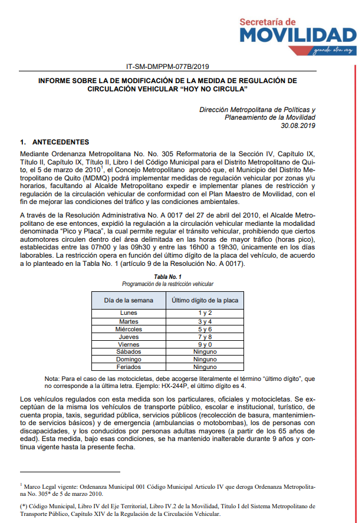

# Pico y Placa Predictor

## Autor: 
Isaac Reyes

### SB 

#### This project is a **predictor de Pico y Placa** which determines whether a vehicle can circulate on a specific day and time based on the regulations described in the image under /assets  , that describe:

Base legal

Inicia con la Ordenanza Metropolitana No. 305, que faculta al Municipio del Distrito Metropolitano de Quito (MDMQ) a implementar medidas de restricción vehicular para mejorar la movilidad y las condiciones ambientales.
Menciona la Resolución Administrativa No. A 0017 (27 de abril de 2010), la cual formalizó la modalidad de restricción “Pico y Placa”, regulando la circulación según el último dígito de la placa.
Alcance de la medida

##### La restricción rige en horas pico (de 07h00 a 09h30 y de 16h00 a 19h30) solo en días laborables (lunes a viernes).
El día de la semana y el dígito final de la placa determinan si un vehículo puede o no circular. Por ejemplo, los lunes se restringen placas terminadas en 1 y 2, los martes en 3 y 4, etc.
Los fines de semana y feriados no hay restricción.
Excepciones

Quedan exentos de la medida los vehículos de transporte público, escolar, institucional, de emergencia, de servicios municipales (basura, mantenimiento) y los que transportan personas con discapacidad o adultos mayores, entre otros.
Vigencia y continuidad

La regulación se ha mantenido sin interrupciones durante 9 años.
El informe sugiere que la medida continúa vigente con el mismo esquema y horarios, aunque se exploran mejoras y modificaciones potenciales.

## Estructura del proyecto
pico_y_placa_predictor/
├── .gitignore
├── README.md
├── requirements.txt
├── assets
│   ├── PicoPlacaInvestigation.png
├── src
│   ├── __init__.py
│   ├── main.py
│   └── predictor.py
└── tests
    ├── __init__.py
    └── test_predictor.py


## Requisitos

- Python 3.7 o superior
- [pip](https://pip.pypa.io/en/stable/) para la instalación de dependencias

## Instalación

1. Clona este repositorio:
   ```bash 
   git clone https://github.com/IGRA27/Pico-Placa-Predictor.git